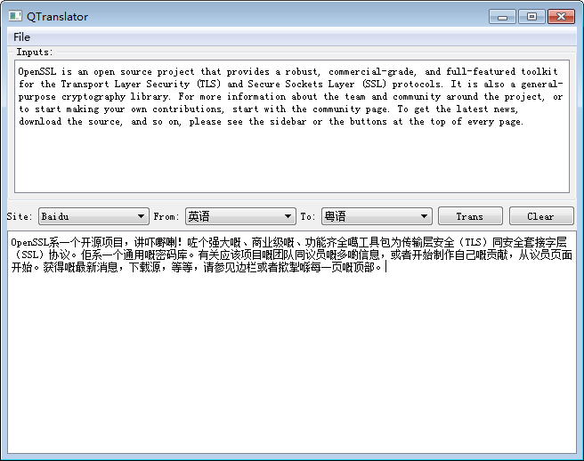
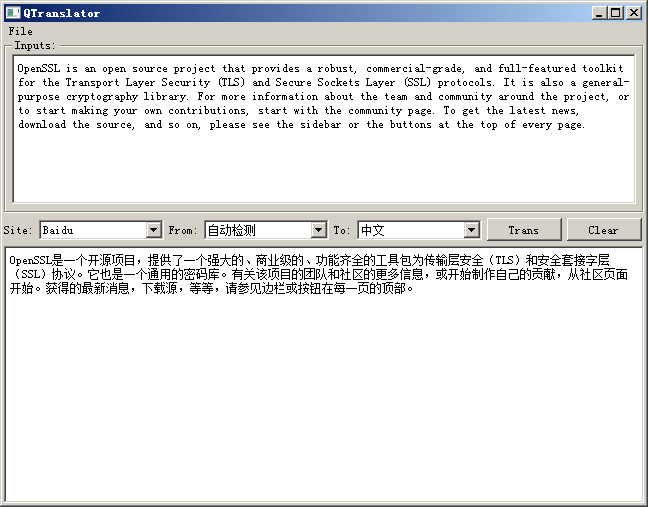
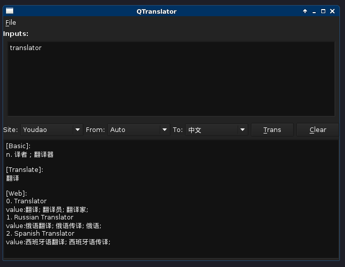

# QTranslator
Translator based on QT5, implemented Baidu and Youdao translate API.

---

# About

QTranslator是一个简单的在线翻译客户端, 使用QT Quick和C++编写. 目前实现了
[百度翻译][Baidu]和[有道翻译][Youdao]的API, 其中百度翻译可以选择多种语言
互相翻译,主要用于整句翻译; 有道的接口在语种和句子长度上有限制, 主要用于
单词和短语的翻译. 其他的在线翻译接口可以通过继承Translator类来自行进行拓展.

# Enviroment

当前的系统上必须先装好编译工具.其中Linux需要有g++,
Windows要有Visual Studio 2013(msvc 12.0)或者更高的版本.
当然,还有[QT][qt].
把工程克隆到本地后, 需要自己修改`QTranslator.pro`工程文件里的外部库文件路径,
用到的库有:

- [boost](http://www.boost.org)
- [libcurl](https://curl.haxx.se/libcurl/)
- [openssl](https://www.openssl.org/)
- [jsoncpp](https://github.com/open-source-parsers/jsoncpp)

# Build

## Linux/Mac

```
$ qmake QTranslator.pro
$ make
```
或者直接用qtcreator打开.

## Windows

直接用qtcreator打开.

# Runtime

编译完成后可执行文件默认存放在`../build-QTranslator-Desktop_$(QT_VERSION)_$(TOOLCHAIN)-(Release/Debug)`下面, 例如:

```
../build-QTranslator-Desktop_Qt_5_5_0_GCC_64bit-Debug
../build-QTranslator-Desktop_Qt_5_5_1_MSVC2013_32bit-Debug
```

如果上面提及的外部库有动态链接的, 运行可执行文件前需要将相应的DLL拷贝当相同目录下(或者在环境变量中设置好).
另外翻译的API需要自己去网站注册申请`appid`和`secret`, 然后填入`config.json`文件中, 
并把此配置文件也放置于可执行文件的同一层目录下.


# Demo

## Windows 7 32bit





## Debian 64bit




[Baidu]:http://api.fanyi.baidu.com/api/trans/product/apidoc
[Youdao]:http://fanyi.youdao.com/openapi
[qt]:http://www.qt.io/
